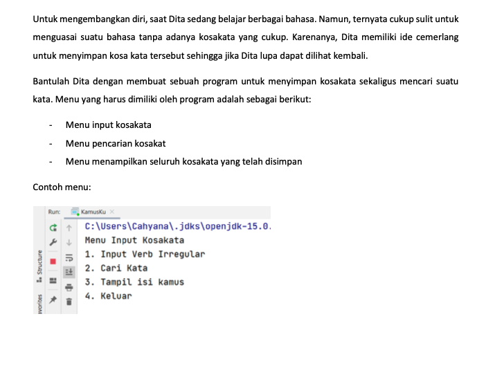
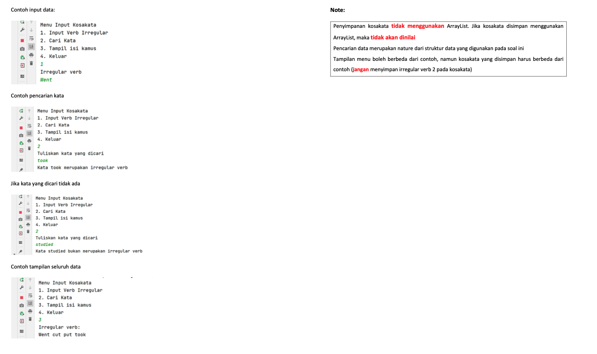
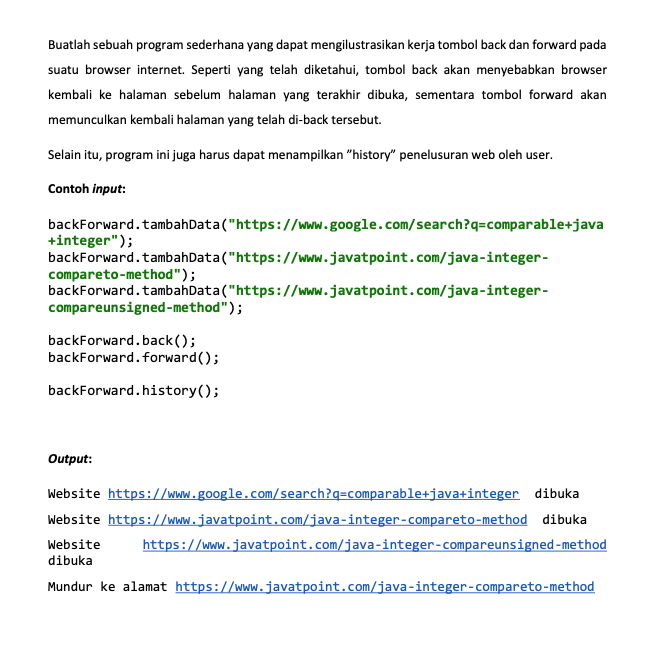
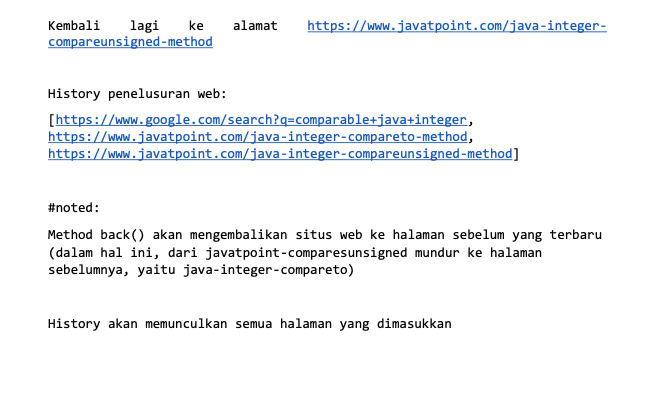
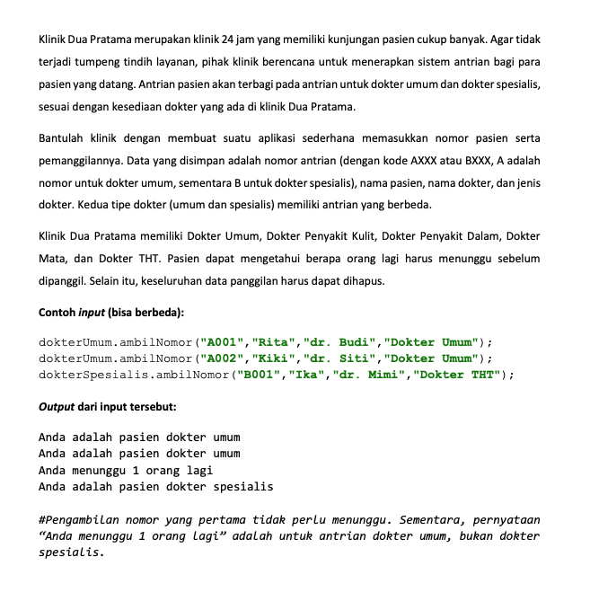
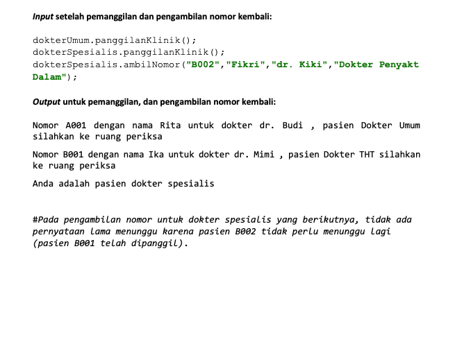

# Identitas

- Nama: Diki Rahman
- NIM: 6706220166
- Kelas: D3 RPLA 46 02

# Soal assesment
1. Assesment 2 tipe C

Source code: https://github.com/dikirahman/re-assesment-isd/tree/master/assesment-2-praktik-tipe-c

2. Assesment 1 tipe E

Source code: https://github.com/dikirahman/re-assesment-isd/tree/master/assesment-1-praktik-tipe-e

3. Assesment 1 tipe B

Source code: https://github.com/dikirahman/re-assesment-isd/tree/master/assesment-1-praktik-tipe-b
